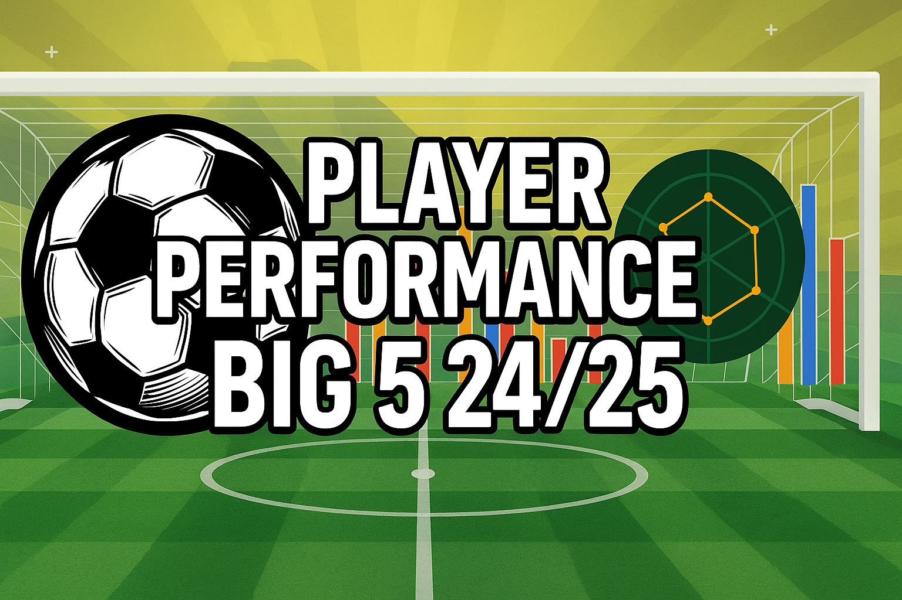
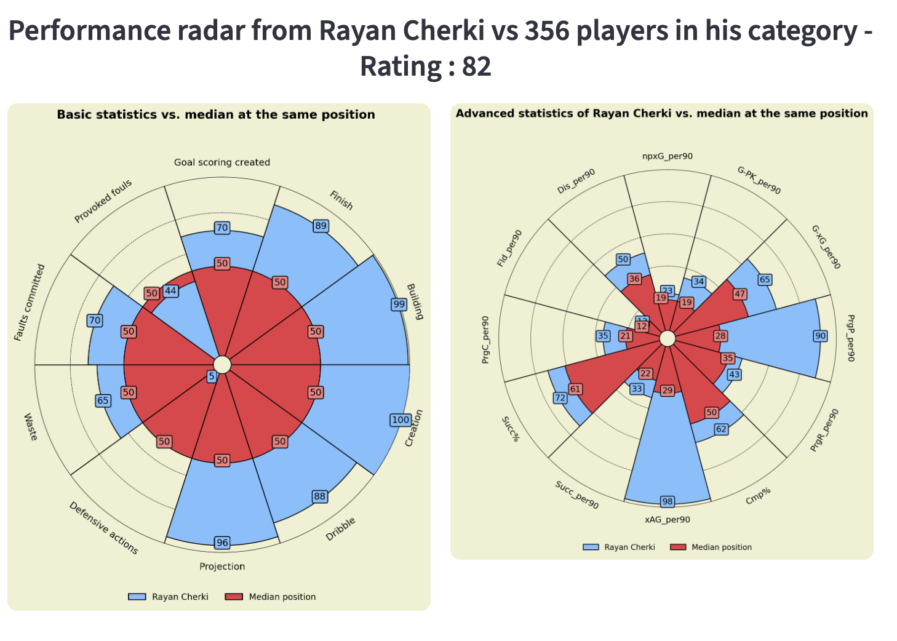
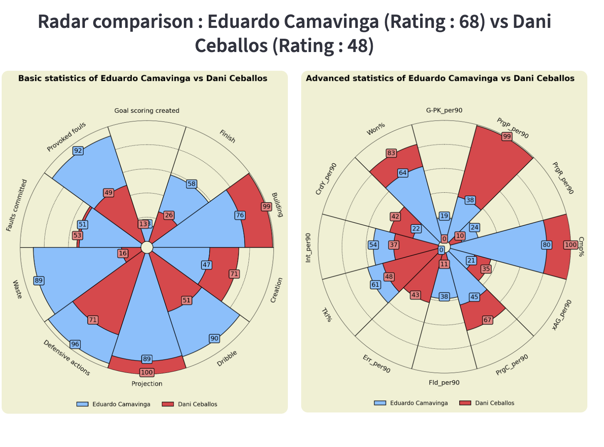
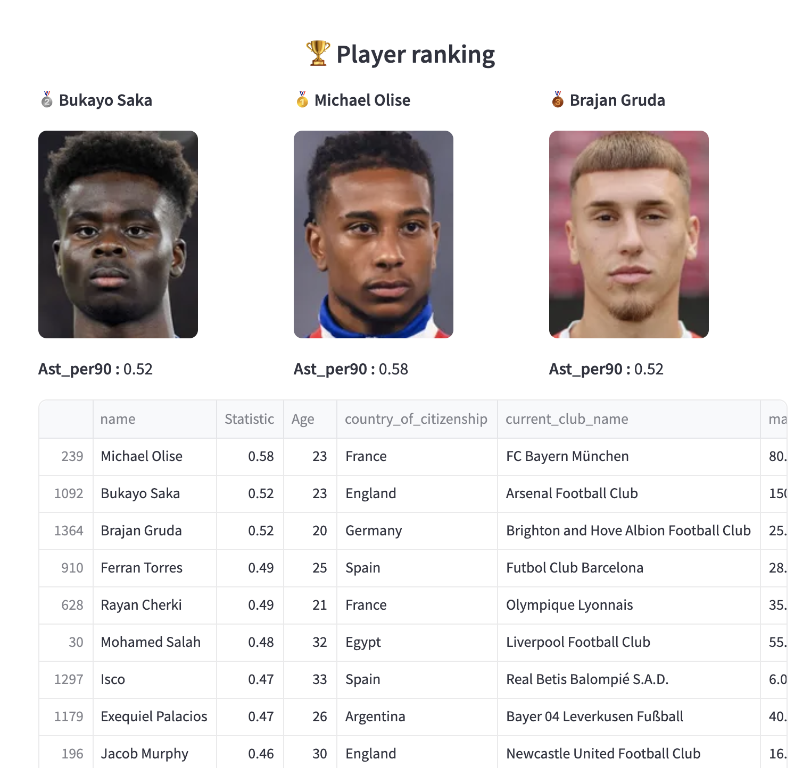
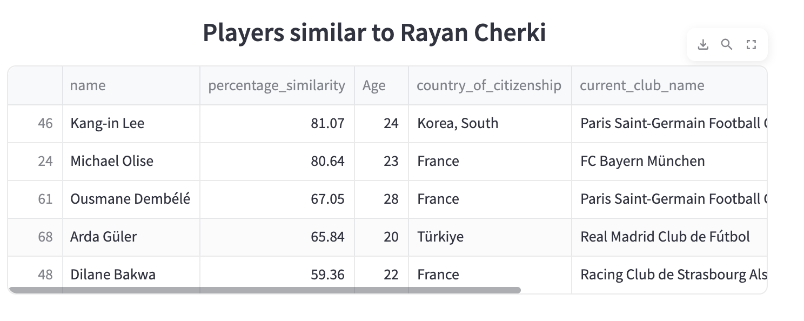

### Français

# Projet de visualisation des performances des joueurs sur la saison 24/25

L'objectif de ce projet est de visualiser les performances des joueurs sur la saison 24/25. Issus du travail de la communauté Kaggle, les données proviennent de Fbref et Transfermarkt
Ce mémoire s'articulant uniquement sur seulement 3 compétitions sur la saison 2022/2023, il m'a paru important d'étendre cette analyse en élargissant le nombre de compétitions et de saisons.  
Ainsi, l'analyse portera sur la saison 24/25 pour les compétitions suivantes : Ligue 1, Bundesliga, Premier League, La Liga, Serie A.

Le projet est disponible sur ce lien : https://player-performance-big-5-24-25-romain-traboul.streamlit.app/

# À faire

Plusieurs fonctionnalités seront disponibles au sein de cette application web : 

- 📊 Analyse d'un Joueur : Analyse du joueur de votre choix à travers plusieurs statistiques
- 🥊 Comparaison entre Joueurs : Analyse comparative entre deux joueurs du même poste
- 🏆 Classement des joueurs (Stats de Base) : Classement des joueurs par performance selon une statistique de base choisie
- 🥇 Classement des joueurs (Stats Avancées) : Classement des joueurs par performance selon une statistique avancée choisie
- 🔎 Scouting : Établissement d'une liste de joueurs collant aux critères choisis

### English

# Project to visualize player performance over the 24/25 season

The goal of this project is to visualize player performances during the 24/25 season. Originally contributed by Kaggle users, the data comes from: Fbref and Transfertmarkt
The analysis will cover the 24/25 season for the following competitions: Ligue 1, Bundesliga, Premier League, La Liga, Serie A.

The project is available at this link: - 

https://player-performance-big-5-24-25-romain-traboul.streamlit.app/

# To do

Several features will be available within this web application: 

- 📊 Player Analysis: Analyze the player of your choice through various statistics
- 🥊 Player Comparison: Compare two players who play in the same position
- 🏆 Player Ranking (Advanced Statistics) : Rank players based on a chosen advanced statistic
- 🥇 Player Ranking (Basis Statistics) : Rank players based on a chosen basis statistic
- 🔎 Scouting : Drawing up a list of players matching the chosen criteria
  

